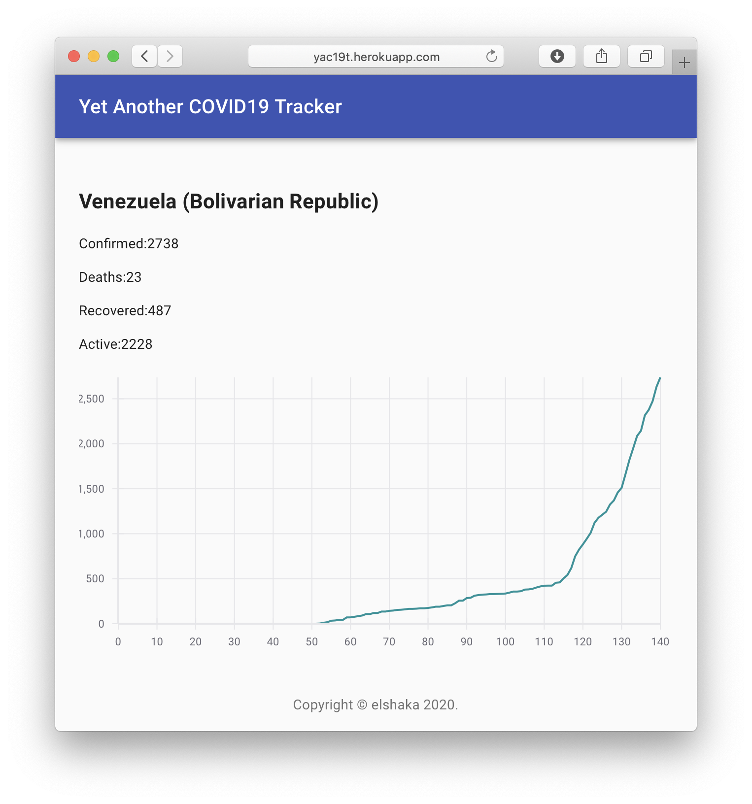

# YAC19T

YAC19T (Yet Another COVID19 Tracker) is a simple app that shows COVID19 stats by country.

## Live Demo

[Live Demo Link](https://yac19t.herokuapp.com)

## Built With

- create-react-app
- Redux
- PropTypes

## Getting Started

To get a local copy up and running follow these simple example steps.

### Setup
    git clone https://github.com/elshaka/yac19t
    cd yac19t
### Install
    npm install
### Run development server
    npm start
### Build
    npm run build
### Deployment
    heroku create $APP_NAME --buildpack mars/create-react-app
    git push heroku master

## Author

👤 **Eleazar Meza**

- Github: [@elshaka](https://github.com/elshaka)
- Linkedin: [Eleazar Meza](https://www.linkedin.com/in/elshaka/)
- Twitter: [@elshaka](https://twitter.com/elshaka)
